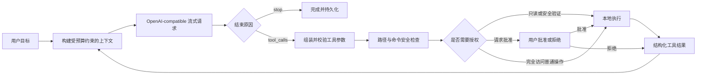
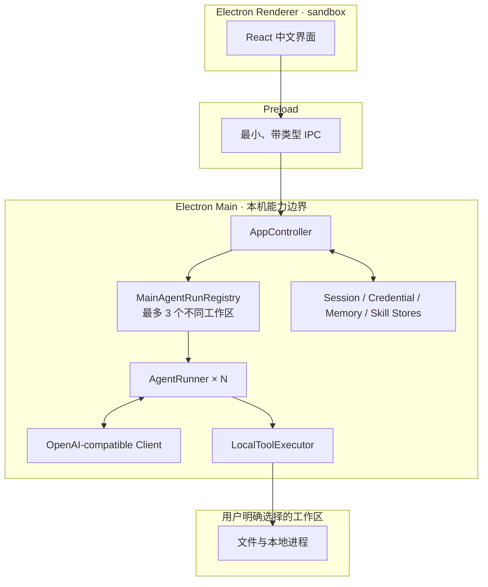

<div align="center">
  
  <h1>HammerCode</h1>
  <p><strong>Forge ideas into working software.</strong></p>
  <p>一个本地优先、过程透明、操作可审批的 macOS 编程智能体。</p>

  <p>
    
    
    
    
    
  </p>

  <p>
    <a href="#快速开始">快速开始</a> ·
    <a href="#核心闭环">核心闭环</a> ·
    <a href="#架构与安全边界">架构</a> ·
    <a href="#质量与验证证据">验证</a> ·
    <a href="#文档索引">文档</a>
  </p>
</div>

---

HammerCode 是南京大学软件学院预推免“构建编程智能体”考核项目。用户选择一个本地工作区并给出开发目标后，模型可以通过本机工具读取代码、提出修改、运行验证；每一步工具意图、授权来源、执行结果和终止原因都可追踪。

项目没有封装 Claude Code、Codex、OpenCode 等现成 agent 产品，也没有使用 LangChain、LlamaIndex、OpenAI Agents SDK、Claude Agent SDK、AutoGen、CrewAI 等 agent 框架。对话历史、上下文预算、流式 tool call 组装、工具校验与本地执行、审批、安全边界、循环终止和错误处理均在仓库内独立实现。

> 核心原则：模型只提出操作意图，HammerCode 负责把它放进有状态、有边界、可审批、可恢复的本地执行闭环。

## 核心闭环



模型的 function call 不会被直接执行。HammerCode 先把分片参数组装完整，再按运行时 schema 校验，通过工作区与风险检查后才进入只读自动执行、用户审批、完全访问自动批准或安全策略直接阻断中的一种路径。

## 已实现能力

### 自主 Agent Core

- OpenAI-compatible `POST /chat/completions`、Bearer 鉴权、SSE 流式文本、`reasoning_content` 和分片 tool calls。
- `fast` / `strong` 是本调试与验收版本的内置默认档位，分别使用 `deepseek-v4-flash` 与 `glm-5.3-flash`；用户也可保存自定义名称、endpoint、API key 和模型 ID 的 OpenAI-compatible 连接。
- 自定义连接选择既有 Fast/Strong 兼容档位，复用经过校验的 provider 请求配置；实际连接、模型、权限和预算在每个 turn 开始时固化，不在失败时静默切换。
- 显式状态机：`idle → requesting → awaiting_approval / executing_tool → completed / cancelled / failed`。
- 有界重试、轮次/工具/运行时间/输出预算，以及 `stop`、`tool_calls`、`length`、内容策略、资源不足、取消等独立终止语义。
- 复杂任务在首次文件副作用或命令前建立可持久化 Plan；已完成步骤不能静默回退。

### 本地工具与安全

- 只读：目录、文本、固定字符串搜索、PDF 文本提取、Git status/diff。
- 有副作用：创建或完整写入、精确文本替换、删除、运行 Python 脚本和本地命令。
- 所有模型参数都视为不可信 JSON，以 Zod 在执行边界校验。
- 真实路径校验覆盖绝对路径、`..`、已存在 symlink 和“symlink 父目录 + 尚不存在文件”的逃逸场景。
- 文件审批前生成 diff，审批后再次比较 SHA-256；原子写入避免半文件，过期意图不会覆盖外部编辑。
- 命令按“自动执行 / 始终审批 / 直接阻断”分类，支持超时、输出截断、取消和进程组清理。

### 连续会话与可解释性

- 同一聊天可在完成、失败或取消后继续；历史工具只作为上下文，不会被恢复逻辑重放。
- 会话、turn、消息、工具轨迹、授权来源、Plan、预算、终止原因和文件变更分别持久化。
- 文件修改按路径汇总为累计 diff；最新且磁盘哈希仍匹配的修改可生成反向 diff，再次审批后撤销。
- 上下文接近阈值时由无工具模型请求压缩，并附加本地事实锚点；完整审计历史仍保留在磁盘。
- 项目记忆按工作区隔离，可控制读取/生成、查看来源、失效与冲突，并支持带校验的本地导入导出。

### 桌面工作台

- 多项目、多聊天导航；不同工作区最多同时运行 3 个主 Agent，同一工作区保持单主任务并明确阻止第二次启动。
- 中文界面实时展示思考、文本、Plan、工具意图、审批、授权来源、命令结果、耗时和上下文占用。
- `请求批准` 与 `完全访问` 两种聊天权限；完全访问只免除普通工作区操作的弹窗，不取消硬安全边界。
- BTW 临时侧边聊天只读取创建时的主线快照，不携带工具、不写会话和项目记忆，关闭即销毁。
- 本地 Skill 采用标准 `SKILL.md` 目录格式，渐进加载并受包指纹、信任、工作区、审批和脚本沙箱限制。
- 主 Agent 可派出最多三个隔离只读子任务；子任务不能递归编排、直接写盘或执行远端操作。

## 架构与安全边界



| 边界 | 设计 |
| --- | --- |
| Renderer | `nodeIntegration: false`、`contextIsolation: true`、`sandbox: true`，不能直接读文件、执行 Shell 或读取环境变量 |
| Preload | 只暴露明确的 `window.hammerCode` IPC 方法，不提供任意 Node API |
| Main | 独占模型访问、凭据、会话持久化、文件系统、审批和子进程生命周期；按 session 管理有界主任务运行项 |
| Agent Core | 不依赖 renderer；模型客户端、工具、审批、时钟和 ID 生成器通过端口注入，便于测试失败与取消分支 |
| Workspace | 所有文件和 cwd 先规范化并校验真实路径；同一真实工作区只允许一个主 Agent，避免写入、审批和状态相互干扰 |
| Credentials | API key 只在 main process 使用；设置页保存时经 Electron `safeStorage` 加密，公开配置永不返回 key |

更完整的设计说明见 [架构与安全设计](docs/ARCHITECTURE.md)。

## 快速开始

### 环境要求

- Apple Silicon Mac
- Node.js 22 或更新版本
- npm
- 可访问已配置的 OpenAI-compatible API
- 可选：Poppler 的 `pdftotext`（PDF 工具）、Python 3（Python 工具）

### 安装与开发运行

```bash
git clone https://github.com/Nortenshawn/HammerCode.git
cd HammerCode
npm ci
cp .env.example .env
# 使用内置档位时在本地 .env 填写对应 API key；也可启动后在设置页新增自定义连接
# .env 仅供本地使用，不得提交或公开
npm run dev
```

本调试版本的内置默认模型配置：

| 档位 | 默认模型 | 默认 Base URL | 思考/推理 |
| --- | --- | --- | --- |
| Fast | `deepseek-v4-flash` | `https://api.deepseek.com` | thinking enabled，`reasoning_effort=high` |
| Strong | `glm-5.3-flash` | `https://open.bigmodel.cn/api/paas/v4` | thinking enabled，`reasoning_effort=max` |

两档默认单次输出预算均为 32K tokens，请求超时为 600 秒。设置页还可新增自定义 OpenAI-compatible 连接；连接信息由用户填写，运行时选择 Fast 或 Strong 兼容档位。开发模式从仓库根目录 `.env` 加载本地配置；打包应用也可从 `~/Library/Application Support/HammerCode/.env` 加载。真实 `.env` 已被 Git 忽略。

### 检查与打包

```bash
npm run typecheck   # renderer、main/preload/core、tests 三套严格类型检查
npm test            # Vitest 全量自动测试
npm run build       # 清理、类型检查、编译 main/preload/core、打包 renderer
npm run package:mac # 生成 release/mac-arm64/HammerCode.app
```

`npm run dev` 的执行顺序是：先用 `tsc` 把 main/preload/core 编译到 `dist/`，再同时启动 Vite renderer 开发服务器和 Electron；Electron main 最终加载开发服务器页面。生产构建则由 Vite 把 React renderer 写入 `dist/renderer/`，Electron 加载本地 HTML。

## 使用方式

1. 打开一个本地文件夹；HammerCode 会将它规范化为聊天绑定的工作区根目录。
2. 选择内置 Fast/Strong 或已保存的自定义连接，再选择“请求批准/完全访问”，输入真实开发任务。
3. 查看流式思考、Plan 和工具链；请求批准模式下，在 diff 或完整命令面板中决定批准或拒绝。
4. 任务结束后查看累计改动、测试结果和终止原因，可在同一聊天继续纠正。
5. 如需回退，选择最新可撤销文件变更，检查反向 diff 并再次批准。

## 质量与验证证据

- 严格 TypeScript 类型检查覆盖 renderer、main/preload/core 和 tests。
- 当前基线为 34 个测试文件、202 项自动测试；覆盖状态机、流组装、跨项目主任务并发、AgentRunner、上下文、路径边界、命令策略、审批、持久化、撤销、BTW、项目记忆、Skill 和隔离子任务。
- 真实 Fast 与 Strong 都通过正式 Electron main/preload/renderer 链路测试；在线证据包含读写、审批、命令、连续 turn、跨项目并发、独立审批与取消、重启恢复、撤销、模型压缩和安全阻断。
- Apple Silicon 目录包可以本地运行；当前未做代码签名、公证和 Mac App Store 沙箱。

自动测试不是在线通过的替代品。每次真实验收使用 `/Users/norten/Developer/HammerTest` 授权沙箱并记录模型、实际副作用和结果，详见 [在线测试报告](docs/ONLINE_TEST_REPORT.md)。

## 关键设计取舍

| 选择 | 原因 | 代价 |
| --- | --- | --- |
| Electron + TypeScript | 同一语言覆盖桌面 UI、IPC、网络、文件和测试，适合本地桌面交互 | 包体较大，正式分发仍需签名、公证与更强 OS 沙箱 |
| OpenAI-compatible Chat Completions | 复用稳定消息与原生 tool calling 边界，同时保留 provider profile | 不同厂商仍有 thinking、tool stream 等字段差异 |
| 模型只提案，本地执行 | 参数、权限和副作用都可审计 | 比直接给 Shell 多一层状态和错误处理复杂度 |
| 保守字符 token 估算 | 无需绑定厂商 tokenizer，行为可测试 | 不是精确 token 数，服务端仍可能返回长度错误 |
| JSON 本地持久化 + 原子替换 | 可阅读、可迁移；索引操作串行化后能支持当前有界并发 | 不适合高并发和超大规模历史 |
| 哈希与反向 diff 撤销 | 不覆盖用户在 agent 之后做的外部修改 | 只覆盖受控文本文件工具，不等价于 Git 回滚 |

## 项目结构

```text
src/
├── core/       # AgentRunner、模型流、上下文、状态机、安全、工具、撤销、记忆与子任务
├── main/       # Electron 生命周期、Controller、凭据/会话/Skill/项目记忆持久化
├── preload/    # contextBridge 暴露的最小 IPC
├── renderer/   # React 中文桌面界面
└── shared/     # main/preload/renderer 共用的公开数据契约
tests/          # 纯函数、边界、失败/取消与模拟端到端测试
skills/         # 随应用发布的内置标准 SKILL.md 包
docs/           # 架构、计划、状态、调研与在线验证证据
```

## 当前边界

- 当前支持平台是 Apple Silicon macOS；目录包未签名、未公证。
- 全局最多同时运行 3 条不同工作区的主 Agent 任务；同一工作区只允许 1 条，隔离子任务仍不能直接写盘。
- 自动撤销只覆盖 HammerCode 文件工具产生的、不超过 1 MB 的 UTF-8 文本变更；命令产生的任意文件变化不进入撤销链。
- 通用 Shell 无法被静态规则证明绝对安全，因此只有很小的本地验证白名单可自动执行，其他命令仍需权限判断或审批。
- 上下文 token 为保守估算值，不等同于厂商 tokenizer。
- 本项目没有内置在线 Skill 市场、自动依赖下载、远程部署或跨平台正式发行。

## 文档索引

- [原始架构与安全设计](docs/ARCHITECTURE.md)
- [最终收敛与开发计划](docs/DEVELOPMENT_PLAN.md)
- [历史完成状态](docs/DEVELOPMENT_STATUS.md)
- [真实模型与桌面验收证据](docs/ONLINE_TEST_REPORT.md)
- [项目记忆调研](docs/MEMORY_SYSTEM_RESEARCH.md)
- [Skill 系统调研](docs/SKILL_SYSTEM_RESEARCH.md)
- [提交说明（README.txt）](README.txt)

## 独立实现声明

基础设施依赖只承担桌面运行时、UI、数据校验、diff、配置加载、构建和测试：Electron、React、Zod、`diff`、dotenv、TypeScript、Vite、Vitest 与 electron-builder。它们不替代 Agent 核心逻辑。

本项目不依赖 API 服务端托管的代码执行、文件读写或工作区工具；所有文件访问和命令执行均由 HammerCode 在用户本机、当前绑定工作区内完成。
